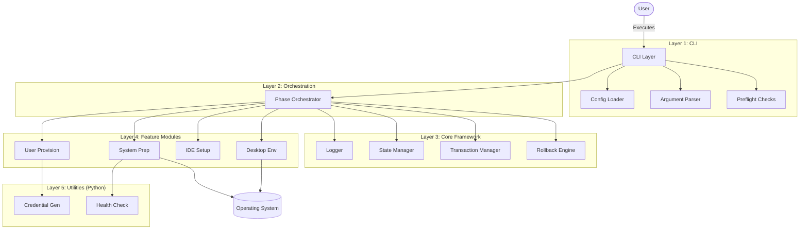
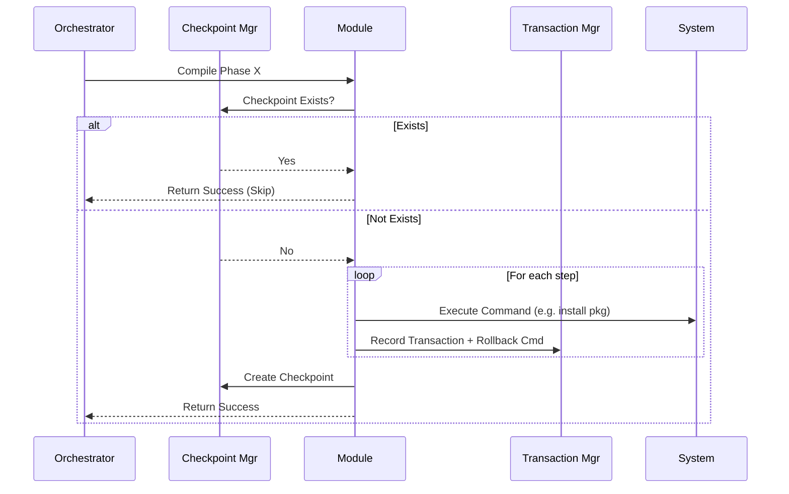

# Project Architecture Blueprint

**Generated**: December 29, 2025
**Version**: 1.0.0
**Project**: VPS Provisioning System (`vps-provision`)

## 1. Architecture Detection and Analysis

### Technology Stack Analysis
The codebase is a **hybrid Bash/Python automation system** designed for Linux system provisioning.

*   **Primary Logic (Control Plane)**: **Bash 5.1+**
    *   Used for: Process orchestration, file system operations, package management, service control.
    *   Evidence: `bin/vps-provision`, `lib/**/*.sh` files.
    *   Key Frameworks: Custom modular architecture, BATS (testing).
*   **Utility Logic (Data Plane/Helpers)**: **Python 3.11+**
    *   Used for: Complex data processing, cryptography, detailed validation, JSON handling.
    *   Evidence: `lib/utils/*.py` files.
    *   Key Libraries: `psutil`, `argparse`, `secrets`.
*   **Configuration**: **INI-style / Key-Value**
    *   Used for: System settings, user preferences.
    *   Evidence: `config/default.conf`.
*   **Build & Automation**: **GNU Make**
    *   Used for: Development workflow, testing, linting.
    *   Evidence: `Makefile`.

### Architectural Pattern Analysis
The system implements a **Layered Architecture** with **Transaction-Based State Management**.

*   **Module Organization**: Strict separation between CLI entry points (`bin/`), core framework services (`lib/core/`), feature modules (`lib/modules/`), and standalone utilities (`lib/utils/`).
*   **Dependency Flow**: Unidirectional flow from CLI → Orchestration → Core Services → OS Resources.
*   **State Management**: Explicit state tracking via:
    1.  **Checkpoints**: For idempotency (write-once markers).
    2.  **Transaction Logs**: For reversible operations (append-only ledger).

## 2. Architectural Overview

### Overall Approach
The `vps-provision` system is designed as a **fail-safe, idempotent, single-command provisioning tool**. It prioritizes reliability and recoverability over speed. The architecture treats the OS provisioning process as a series of atomic transactions that can be rolled back upon failure.

### Guiding Principles
1.  **Idempotency Strategy**: The system must be runnable multiple times without side effects. If a phase is complete, it is skipped.
2.  **Fail-Safe / Atomic Operations**: Every change to the system state is recorded with a corresponding rollback command. If the process fails, the system automatically unwinds to the last clean state.
3.  **Strict Layering**: Core services do not depend on business modules. Utilities are stateless and isolated.
4.  **Progressive Disclosure**: The UI provides high-level progress (bars/percentages) while logging detailed technical data to files.
5.  **Security by Default**: All user inputs are sanitized; credentials are generated securely and never stored in plain text configuration.

### Architectural Boundaries
*   **CLI vs. Library**: The `bin/` directory contains executable entry points that parse arguments and load configuration. The `lib/` directory contains sourced functions.
*   **Core vs. Features**: `lib/core/` provides the "operating system" for the script (logging, error handling, state), while `lib/modules/` provides the business logic (installing XFCE, VSCode, etc.).
*   **Shell vs. Python**: Bash handles OS-level piping and commands; Python handles complex logic where Bash is brittle (crypto, JSON, floating-point math).

## 3. Architecture Visualization

### High-Level Architecture


### Component Interaction (Idempotency Flow)


## 4. Core Architectural Components

### 1. Logger (`lib/core/logger.sh`)
*   **Purpose**: Centralized logging system.
*   **Responsibility**: Writes structured logs to console (colored) and file (plain text). Handles sensitivity redaction.
*   **Interaction**: Called by all other modules.

### 2. Checkpoint Manager (`lib/core/checkpoint.sh`)
*   **Purpose**: Enforce idempotency.
*   **Internal Structure**: File-based markers in `/var/vps-provision/checkpoints/`.
*   **Interaction**: Checked at the start of every module execution; written at the end of successful execution.

### 3. Transaction Manager (`lib/core/transaction.sh`)
*   **Purpose**: Enable rollback capability.
*   **Internal Structure**: Append-only log file (`transaction.log`) storing `timestamp`, `description`, `rollback_command`.
*   **Interaction**: Modules report every state change to this component.

### 4. Rollback Engine (`lib/core/rollback.sh`)
*   **Purpose**: Restore system stability after failure.
*   **Responsibility**: Reads transaction log in reverse (LIFO) and executes rollback commands.
*   **Interaction**: Triggered by the global error trap loop.

### 5. Input Sanitizer (`lib/core/sanitize.sh`)
*   **Purpose**: Security boundary.
*   **Responsibility**: Validates and cleans user inputs (usernames, paths) to prevent injection and traversal attacks.

## 5. Architectural Layers and Dependencies

The system follows a strict download dependency flow.

1.  **CLI Layer** (`bin/`)
    *   **Orchestration**: Directs the flow control.
    *   **Dependencies**: Depends on Core and Modules.
2.  **Core Layer** (`lib/core/`)
    *   **Foundation**: Provides the runtime environment.
    *   **Dependencies**: Zero dependencies on Modules. Depends on OS utilities.
3.  **Module Layer** (`lib/modules/`)
    *   **Business Logic**: Implements specific provisioning tasks (e.g., install VSCode).
    *   **Dependencies**: Depends on Core Layer and Utility Layer.
4.  **Utility Layer** (`lib/utils/`)
    *   **Helpers**: Standalone Python scripts.
    *   **Dependencies**: Isolated, minimal dependencies.

**Violation Rules**:
*   Modules must not source other modules (circular dependency prevention).
*   Core must not call Modules.

## 6. Data Architecture

The system uses efficient file-based data structures without a heavy database engine.

*   **Configuration**:
    *   Primary: `config/default.conf` (sourceable Bash variables).
*   **Runtime State**:
    *   Checkpoints: Empty files named by phase (e.g., `system-prep.checkpoint`).
    *   Transaction Log: TSV (Tab Separated Values) file.
*   **Persistence Strategy**:
    *   All state is stored in `/var/vps-provision/`.
    *   Advantages: Simple to inspect, easy to back up, survives reboots.

## 7. Cross-Cutting Concerns Implementation

### Authentication & Authorization
*   **Root Enforcement**: The entry point checks for EUID 0. Non-root execution is blocked immediately.
*   **User Management**: The `user-provisioning` module creates a standard user with `sudo` access, enforcing separation of privileges for the end user.

### Error Handling & Resilience
*   **Global Trap**: A wrapper trap catches `ERR` signals.
*   **Automatic Rollback**: On error, the system pauses, runs the defined rollback commands for the current session, and cleans up.
*   **Retry Logic**: Network operations (APT, downloads) use exponential backoff wrappers found in `lib/core/network.sh` (implied) or module logic.

### Logging & Observability
*   **Dual output**: User sees friendly progress bars (`lib/core/progress.sh`); Admins see detailed debug logs (`/var/log/vps-provision/provision.log`).

## 8. Service Communication Patterns
*   **Internal**: Direct function calls via `source`.
*   **External (System)**: `systemctl` for service management; `apt-get` for package management.
*   **Inter-Process**: Shell-to-Python communication via subshells `$(python3 ...)` and JSON return values.

## 9. Technology-Specific Architectural Patterns

### Bash Patterns
*   **Guard Clauses**: Files start with `if [[ -n "${_MODULE_LOADED}" ]]; then return; fi` to prevent double-sourcing and variable re-declaration errors.
*   **Scope Management**: Extensive use of `local` variables to prevent namespace pollution.
*   **Strict Mode**: `set -euo pipefail` is mandatory in all files.

### Python Patterns
*   **Type Safety**: Usage of `mypy` and type hints (`-> str`, `: int`) even in small scripts.
*   **Standard Library First**: Minimizing `pip` dependencies to ensure ease of bootstrap.

## 10. Implementation Patterns

### Module Implementation Template
Every feature module follows this pattern:
```bash
module_execute() {
    # 1. Idempotency Check
    if checkpoint_exists "phase_name"; then return 0; fi

    # 2. Progress Registration
    progress_phase_start "phase_name"

    # 3. Execution with Transaction Recording
    run_command
    transaction_record "Description" "Undo Command"

    # 4. Checkpoint Creation
    checkpoint_create "phase_name"
}
```

## 11. Testing Architecture

*   **Unit Tests (`tests/unit`)**: BATS tests for individual functions. Mocks `apt`, `systemctl`.
*   **Integration Tests (`tests/integration`)**: Tests interaction between Core and Modules.
*   **End-to-End Tests (`tests/e2e`)**:
    *   **Docker**: Fast, isolated container testing.
    *   **KVM**: Full VM provisioning test (closest to production).

## 12. Deployment Architecture
*   **Single-File Distribution**: The repo can be cloned, or the directory structure is preserved.
*   **Bootstrap**: `make install` or manual dependency check (`bin/preflight-check`).

## 13. Extension and Evolution Patterns

### Feature Addition Patterns
*   **New Modules**: Add a script to `lib/modules/`. Register it in the `PHASES` array in `bin/vps-provision` and `config/default.conf`.
*   **New IDEs**: Follow the `ide-template.sh` pattern: `check_prereq` -> `add_repo` -> `install` -> `verify` -> `checkpoint`.

## 14. Architectural Decision Records

*   **Use of Bash**: Chosen for zero-dependency execution on fresh Debian systems. Python is only used where Bash is insufficient.
*   **Checkpoint System**: Explicit markers chosen over state-inspection (e.g., checking if package is installed) to distinguish between "manually installed by user" and "provisioned by tool".
*   **Transaction Log**: Chosen instead of snapshots (LVM/Btrfs) to work on any filesystem and allow granular rollback of specific script actions.

## 15. Architecture Governance
*   **Linting**: `shellcheck` (critical), `shfmt`, `pylint`, `black` are enforced via `Makefile` and CI hooks.
*   **Pre-commit**: Hooks run fast linters.
*   **Code Review**: PRs must pass the test suite.

## 16. Blueprint for New Development

### Workflow for Adding a Feature
1.  **Create Module**: `lib/modules/my-feature.sh`.
2.  **Define Interface**: Implement `my_feature_execute`.
3.  **Add Configuration**: Add defaults to `config/default.conf`.
4.  **Register Phase**: Add to `programs/main` orchestration list.
5.  **Write Tests**: Create `tests/unit/my_feature.bats`.

### Common Pitfalls
*   **Forgetting Rollback**: Every state change MUST have a `transaction_record`.
*   **Global Variables**: Use `local` for everything unless intended for config.
*   **Hardcoded Paths**: Use configuration variables (`${CONFIG_DIR}`, `${LOG_FILE}`).
